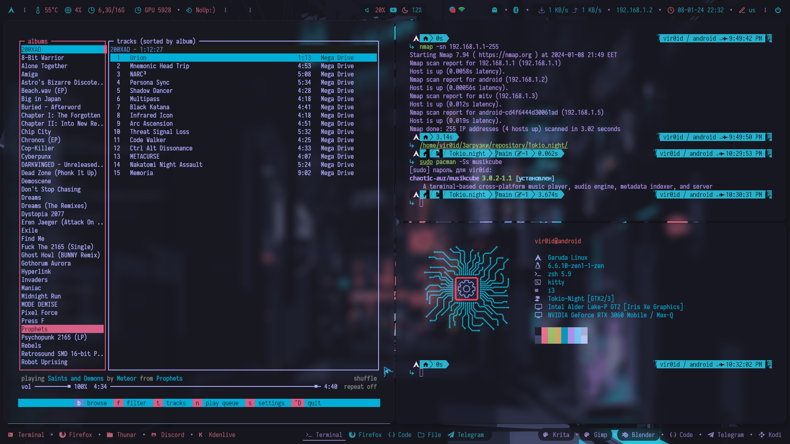
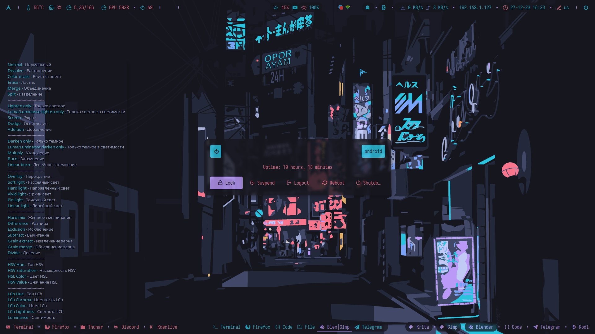

## Information


- **OS:** [Garuda Linux](https://garudalinux.org/)
- **WM:** [i3-gaps](https://github.com/Airblader/i3)
- **Terminal:** [Kitty](https://sw.kovidgoyal.net/kitty/)
- **Text Editor:** [Micro](https://micro-editor.github.io/)
- **Fonts:** [Iosevka Term](https://github.com/be5invis/Iosevka)
- **Bar:** [Polybar](https://github.com/polybar/polybar)
- **Shell:** [Ohmyposh](https://ohmyposh.dev/docs/installation/linux)
- **Compositor:** [Picom](https://github.com/yshui/picom)
- **Application Launcher:** [Rofi](https://github.com/davatorium/rofi)
- **Notification Deamon:** [Dunst](https://github.com/dunst-project/dunst)
- **Splitt terminal:** [Autotiling](https://github.com/nwg-piotr/autotiling)
- **Video Card:** [Nvidia](https://developer.nvidia.com/nvidia-system-management-interface)
- **Backlight:** [Nvidia-smi](https://developer.nvidia.com/nvidia-system-management-interface)
- **Music Player:** [Musikcube](https://github.com/clangen/musikcube)
- **Music Player Youtube Playlists:** [Mpv](https://mpv.io/)
- **Multimedia framework:** [PipeWire](https://pipewire.org/)


Установочный скрипт тестировался на чистом Arch Linux в виртуальной машине. 
Если у вас появятся какие-то проблемы в процессе установки, то я вас предупрежу:
> [!CAUTION]
> ⚠️⚠️⚠️ Пожалуйста, сделайте бэкап!!
> см.в "Ручная установка"!! ⚠️⚠️⚠️  

Если у вас чистая система, тогда скрипт нужно запускать два раза. 
Первый раз это нужно для того, что бы Firefox создал свои файлы и каталоги настроек в ~/.mozilla/. 

> [!IMPORTANT]
> Важно запустить Firefox и закрыть.
> Затем запустить скрипт второй раз.

Если у вас система не с нуля, тогда скрипт запускается один раз.

Этот скрипт проверит, есть ли у вас необходимые пакеты, и если нет, тогда он их установит. 
Этот скрипт сделает бэкап сам в каталог ~/.Backup_files

<br>

> [!CAUTION]
> ⚠️⚠️⚠️ После запуска скрипта, вам будет предложены соглашения с вашими действиями.
> Будте на чеку!! ⚠️⚠️⚠️

<br>

<details>
  <summary>Screenshots</summary>








</details>

<details>
  <summary>Ручная установка</summary>
Нужные пакеты! Если у вас имеется что-то из списка, то устанавливайте те, которых у вас нету.

Пакеты из дефолтных реп

```python
sudo pacman -S dialog yad cmus rsync mpv jq socat stalonetray kitty lsd ranger micro blueman thunar polybar rofi dunst nitrogen picom yt-dlp fzf mcfly neofetch zsh zsh-syntax-highlighting zsh-history-substring-search starship
```

Гит-пакеты

```python
yay -S zscroll-git
yay -S ytdlp-gui
yay -S oh-my-zsh-git
yay -S oh-my-posh-bin
yay -S autotiling
yay -S musikcube
yay -S pamac-aur
yay -S kazam
```

$${\color{red}!! ВАЖНО !!}$$ 
Установочный скрипт пока еще находится в разработке, поэтому обязательсно сделать backup своих конфигураций.

```python
mkdir ~/backup
rsync -aAEHSXxrv --exclude=".cache/mozilla/*" ~/.[^.]* ~/backup
```

$${\color{lightgreen}Необходимые \space условия \space путей, \space для \space корректной \space работы.}$$

 
1. Содержимое папки user нужно закинуть в домашний каталог "~/" 

> Каталоги polybar и rofi должны быть тут ~/.config/i3

2. Сделать записи в свой текущий i3/config. 

>В случае земены содепжимого, эти записи делать не нужно.

<details>
  <summary>Открой</summary>

```python
exec_always --no-startup-id "$HOME/.config/i3/polybar/Tokio_night/launch.sh"
```

```python
exec --no-startup-id "picom -b --config ~/.config/i3/picom.conf"
```

```python
exec_always --no-startup-id autotiling
```

</details>

3. Изменить мой .zshrc
```python
# Custom exports
export MICRO_CONFIG_HOME=/home/vir0id/.config/micro
```
на

```python
# Custom exports
export MICRO_CONFIG_HOME=/home/ВАШ-ЮЗЕР/.config/micro
```

4. Установить обоину из .wallpapers туда, куда вам нужно

4.1. Если у вас был bash и вы хотели бы его поменять на кастомный zsh, тогда в терминале нужно ввести команды. Для смены шелла

```python
sudo chsh -s /usr/bin/zsh
``` 

5. Перезапустить i3

$${\color{red}!! ВАЖНО !!}$$
В любом случае, все модули polybar, которые присутствуют у меня, дожны быть настроены в соответствии с вашими желаниями и вашей машиной.

$${\color{lightgreen}Что \space еще \space ?}$$

1. Еще есть тема оформления для blender. Папка соответствующая.
```python
~/.config/blender/Ваша версия/config/colorshemas/
```

2. Ссылка на тему [Telegram](https://t.me/addtheme/pIK0pC3eIoopeaG7)

3. Цветовая тема для плеера cmus.

> Открыть плеер, нажать ":" и вставить это:

```python
colorscheme Tokio_night
```

4. Ссылка на тему [Firefox](https://addons.mozilla.org/en-US/firefox/addon/tokio_night/?utm_source=addons.mozilla.org&utm_medium=referral&utm_content=search)

5. Плеер mpv умеет искать треки и загружать музыкальный плейлист из Youtube. Иконка присутствует на polybar

$${\color{lightgreen}Управление \space окнами \space в \space случае \space замены \space config.}$$

<details>

|        Keybind         |                 Function                 |
| ---------------------- | ---------------------------------------- |
| `Mod + Q`              | Закрыть окно                             |
| `Mod + D`              | Открыть appmenu                          |
| `Mod + [1-9]`          | Переключить рабочее простронство [1-9]   |
| `Mod + Shift + [1-9]`  | Передвинуть окно на пространство [1-9]   |
| `Mod + H`              | Разделение окон по вертикали             |
| `Mod + V`              | Разделение окон по горизонтали           |
| `Mod + Shift + R`      | Перезапустить i3                         |
| `Mod + Enter`          | Открыть терминал                         |
| `Alt + Enter`          | Открыть терминал в режиме ranger         |
| `Mod + C`              | Сделать окно плавающим и обратно         |
| `Mod + T`              | Разделить закладки в строку              |
| `Mod + Y`              | Разделить закладки в столбик             |
| `Mod + U`              | Разделить закладки                       |
| `Print`                | Скриншот экрана                          |

> Подробнее смотреть в ~/.config/i3/keybinds