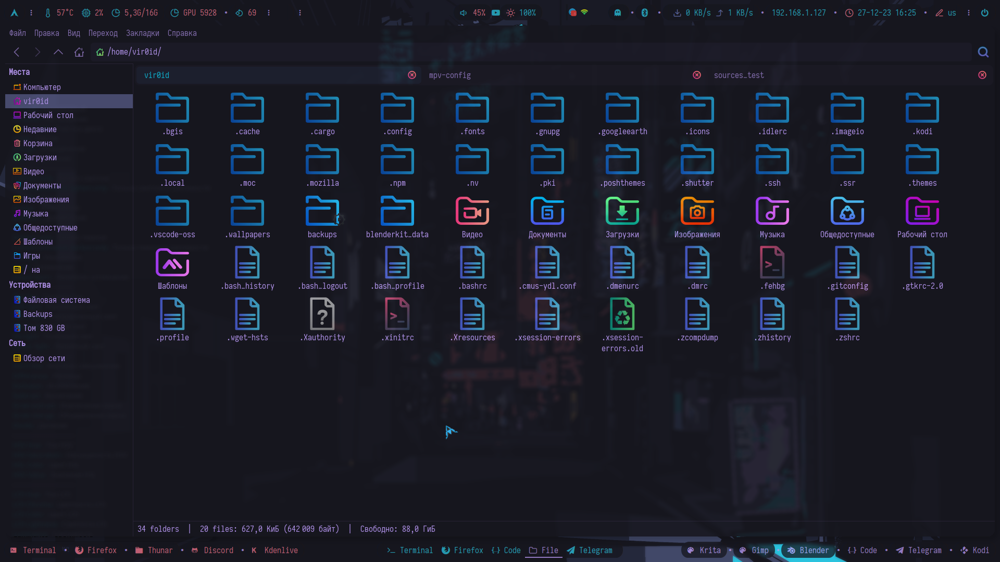

## Information


- **OS:** [Garuda Linux](https://garudalinux.org/)
- **WM:** [i3-gaps](https://github.com/Airblader/i3)
- **Terminal:** [Xfce4-Terminal](https://docs.xfce.org/apps/terminal/start)
- **Fonts:** [Iosevka Term](https://github.com/be5invis/Iosevka)
- **Bar:** [polybar](https://github.com/polybar/polybar)
- **Shell:** [ohmyposh](https://ohmyposh.dev/docs/installation/linux)
- **Compositor:** [picom](https://github.com/yshui/picom)
- **Application Launcher:** [rofi](https://github.com/davatorium/rofi)
- **Notification Deamon:** [dunst](https://github.com/dunst-project/dunst)
- **Splitt terminal:** [autotiling](https://github.com/nwg-piotr/autotiling)
- **Video Card:** [Nvidia](https://developer.nvidia.com/nvidia-system-management-interface)
- **Backlight:** [Nvidia-smi](https://developer.nvidia.com/nvidia-system-management-interface)
- **Music Player:** [Cmus](https://cmus.github.io/)
- **Music Player Youtube Playlists:** [Mpv](https://mpv.io/)

Нужные пакеты! Если у вас имеется что-то из списка, то устанавливайте те, которых у вас нету.

```python
sudo pacman -S dialog cmus rsync mpv xfce4-terminal thunar polybar rofi dunst nitrogen fzf mcfly neofetch zsh zsh-syntax-highlighting zsh-history-substring-search zsh-syntax-highlighting starship
```
$${\color{red}!! ВАЖНО !!}$$ 
Обязательсно сделать backup своих конфигураций.

```python
mkdir ~/backup
rsync -aAEHSXxrv --exclude=".cache/mozilla/*" ~/.[^.]* ~/backup
```

$${\color{lightgreen}Необходимые \space условия \space путей, \space для \space корректной \space работы.}$$

 
1. Содержимое папки user нужно закинуть в домашний каталог "~/" 
> polybar, picom и rofi уже должны быть установлены в вашей системе 

> Каталоги polybar и rofi должны быть тут ~/.config/i3

2. Найти и установить [ohmyposh](https://ohmyposh.dev/docs/installation/linux) и [ohmyzsh](https://github.com/ohmyzsh/ohmyzsh) Не обязательно, если вы не хотите. Но внешний вид терминала, у вас, может быть другим.

> В Arch-based дистрибутивах есть пакет (AUR):

```python
yay -S oh-my-posh-bin
```

```python
yay -S oh-my-zsh-git
```

3. Установить [autotiling](https://github.com/nwg-piotr/autotiling)

> Для Arch-based дистрибутивов есть пакет autotiling в AUR

```python
yay -S autotiling
```

4. Сделать записи в свой текущий i3/config. 

>В случае земены содепжимого, эти записи делать не нужно.

```python
exec_always --no-startup-id "$HOME/.config/i3/polybar/Tokio_night/launch.sh"
```

```python
exec --no-startup-id "picom -b --config ~/.config/i3/picom.conf"
```

```python
exec_always --no-startup-id autotiling
```

5. Установить обоину из .wallpapers туда, куда вам нужно

6. Перезапустить i3

$${\color{red}!! ВАЖНО !!}$$
В любом случае, все модули polybar, которые присутствуют у меня, дожны быть настроены в соответствии с вашими желаниями и вашей машиной.

$${\color{lightgreen}Что \space еще \space ?}$$

> В случае земены содержимого, эти записи делать не нужно.

<details>
  <summary>Открой</summary>

1. Еще есть тема оформления для blender. Папка соответствующая.
```python
~/.config/blender/Ваша версия/config/colorshemas/
```

2. Чтоб приминить тему poshthemes, нужно отредактировать ваш .zshrc добавив строку в самый низ

```python
eval "$(oh-my-posh init zsh --config ~/.poshthemes/Tokio_night.omp.json)"
```
</details>

3. Ссылка на тему [Telegram](https://t.me/addtheme/pIK0pC3eIoopeaG7)

4. Цветовая тема для плеера cmus.

> Открыть плеер, нажать ":" и вставить это:

```python
colorscheme Tokio_night
```

5. Ссылка на тему [Firefox](https://addons.mozilla.org/en-US/firefox/addon/tokio_night/?utm_source=addons.mozilla.org&utm_medium=referral&utm_content=search)

6. Плеер mpv умеет загрузать плейлист из Youtube. Нужно лишь заменить ссылку плейлиста на свою. Файлик тут:
> .config/i3/scripts/mpv-youtube-playlist.sh
   
   Для примера... Замени https://www.... на свою:

```python
mpv -ao=pulse --no-video --shuffle --term-playing-msg='Title: ${media-title}' "https://www.youtube.com/playlist?list=PLQQ-A7Ds57kTCJ750usNrWbP2rt4SIpfy"
```

$${\color{lightgreen}Управление \space окнами \space в \space случае \space замены \space config.}$$


|        Keybind         |                 Function                 |
| ---------------------- | ---------------------------------------- |
| `Mod + Q`              | Закрыть окно                             |
| `Mod + D`              | Открыть appmenu                          |
| `Mod + [1-9]`          | Переключить рабочее простронство [1-9]   |
| `Mod + Shift + [1-9]`  | Передвинуть окно на пространство [1-9]   |
| `Mod + H`              | Разделение окон по вертикали             |
| `Mod + V`              | Разделение окон по горизонтали           |
| `Mod + Shift + R`      | Перезапустить i3                         |
| `Mod + Enter`          | Открыть терминал                         |
| `Mod + C`              | Сделать окно плавающим и обратно         |
| `Mod + T`              | Разделить закладки в строку              |
| `Mod + Y`              | Разделить закладки в столбик             |
| `Mod + U`              | Разделить закладки                       |
| `Print`                | Скриншот экрана                          |

> Подробнее смотреть в ~/.config/i3/keybinds

<details>
  <summary>Screenshots</summary>





</details>