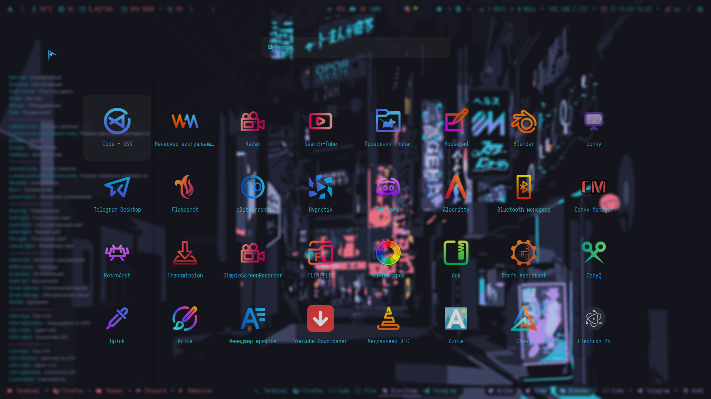
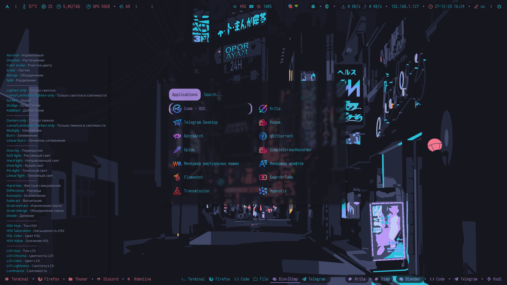
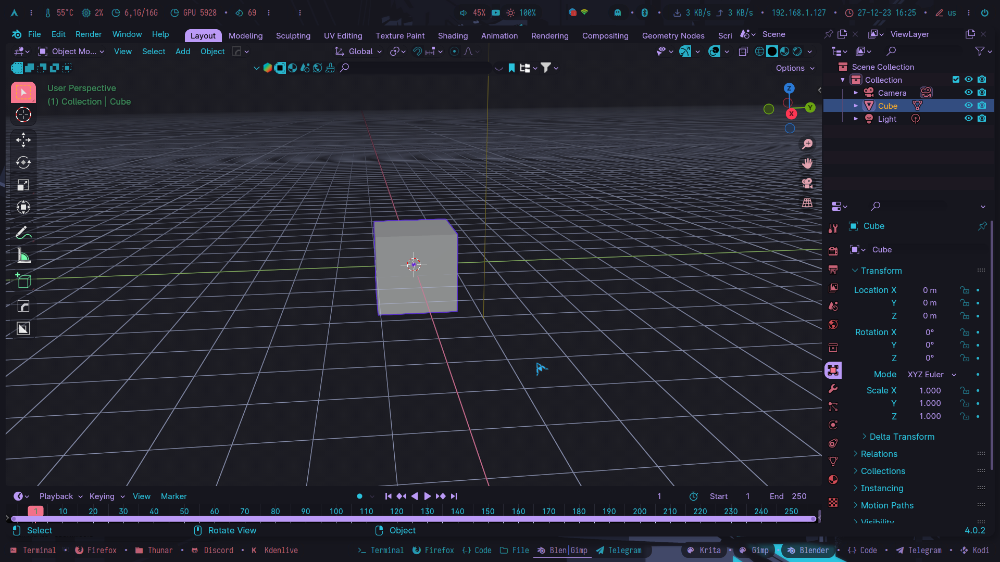

 

$${\color{lightgreen}Необходимые \space условия \space путей, \space для \space корректной \space работы.}$$

 
1. Содержимое папки user нужно закинуть в домашний каталог "~/" 
> polybar, picom и rofi уже должны быть установлены в вашей системе 

$${\color{red}!! ВАЖНО !!}$$ 
> Каталоги polybar и rofi должны быть тут ~/.config/i3

2. Найти и установить шрифт [Iosevka Term](https://github.com/be5invis/Iosevka)

> В Arch-based дистрибутивах есть пакеты:

```python
sudo pacman -S ttf-iosevkaterm-nerd ttf-iosevka-nerd
```

3. Найти и установить [ohmyposh](https://ohmyposh.dev/docs/installation/linux) и [ohmyzsh](https://github.com/ohmyzsh/ohmyzsh) Не обязательно, если вы не хотите. Но внешний вид терминала, у вас, может быть другим.

> В Arch-based дистрибутивах есть пакет (AUR):

```python
yay -Ss oh-my-posh-bin
```

```python
yay -Ss oh-my-zsh-git
```

4. Установить [autotiling](https://github.com/nwg-piotr/autotiling)

> Для Arch-based дистрибутивов есть пакет autotiling в AUR

```python
yay -S autotiling
```

5. Сделать записи в свой текущий i3/config. 

>В случае земены config файла своего на мой, эти записи делать не нужно.

```python
exec_always --no-startup-id "$HOME/.config/i3/polybar/Tokio_night/launch.sh"
```

```python
exec --no-startup-id "picom -b --config ~/.config/i3/picom.conf"
```

```python
exec_always --no-startup-id autotiling
```

6. Установить обоину из .wallpapers туда, куда вам нужно

7. Перезапустить i3

$${\color{red}!! ВАЖНО !!}$$
В любом случае, все модули polybar, которые присутствуют у меня, дожны быть настроены в соответствии с вашими желаниями и вашей машиной.

$${\color{lightgreen}Что \space еще \space ?}$$

1. Еще есть тема оформления для blender. Папка соответствующая.
```python
~/.config/blender/Ваша версия/config/colorshemas/
```

2. Чтоб приминить тему poshthemes, нужно отредактировать ваш .zshrc добавив строку в самый низ

```python
eval "$(oh-my-posh init zsh --config ~/.poshthemes/Tokio_night.omp.json)"
```

3. Ссылка на тему [Telegram](https://t.me/addtheme/pIK0pC3eIoopeaG7)

4. Цветовая тема для плеера cmus.

> Открыть плеер, нажать ":" и вставить это:

```python
colorscheme Tokio_night
```

5. Ссылка на тему [Firefox](https://addons.mozilla.org/en-US/firefox/addon/tokio_night/?utm_source=addons.mozilla.org&utm_medium=referral&utm_content=search)

$${\color{lightgreen}Управление \space окнами \space в \space случае \space замены \space config.}$$

<details>
  <summary>Keybinds</summary>

  ```
  В моем случае используется xfce4-terminal. Скриншотка Kazam. Zsh шел.

1. Закрыть окно

```python
mod+q
```

2. Открыть appmenu

```python
mod+d
```

3. Переключиться на рабочее простронство [1-9]

```python
mod+[1-9]
```

4. Передвинуть окно на рабочее пространство [1-9]

```python
mod+shift+[1-9]
```

5. Разделение окон по вертикали

```python
mod+h
```

6. Разделение окон по горизонтали

```python
mod+v
```

7. Перезапустить i3

```python
mod+sift+r
```

8. Открыть терминал (xfce4-terminal)

```python
mod+Enter
```

9. Сделать окно плавающим и обратно

```python
mod+c
```

10. Управление закладками окон

В строку:
```python
mod+t
```

В столбик:
```python
mod+y
```

Разделить:
```python
mod+u
```

11. Полноэкранный режим окна и обратно

```python
mod+f
```

12. Скриншот экрана

```python
Print
```
  ```
</details>

> Подробнее смотреть в /.config/i3/keybinds

